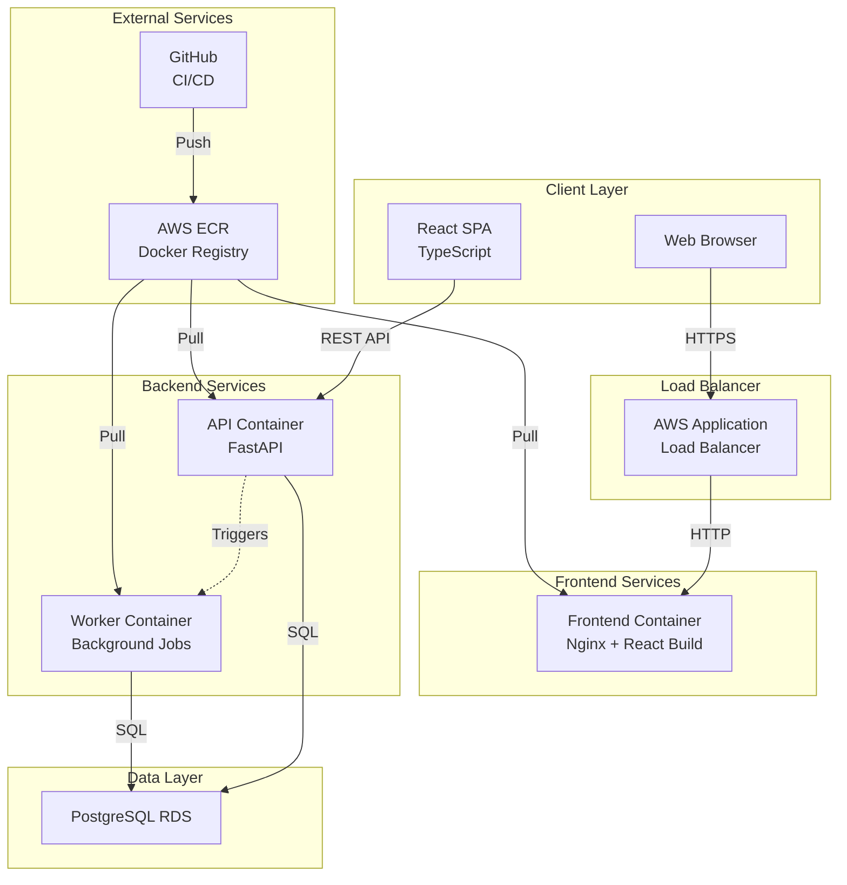
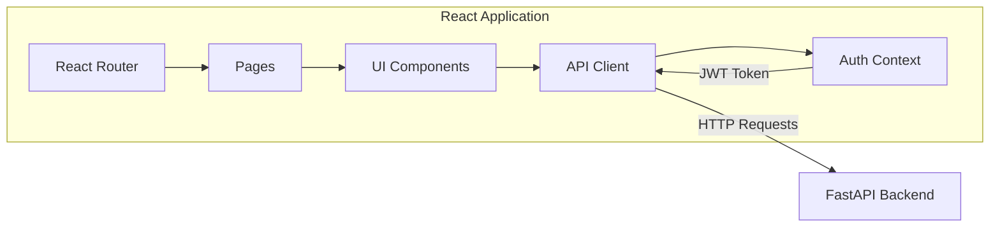
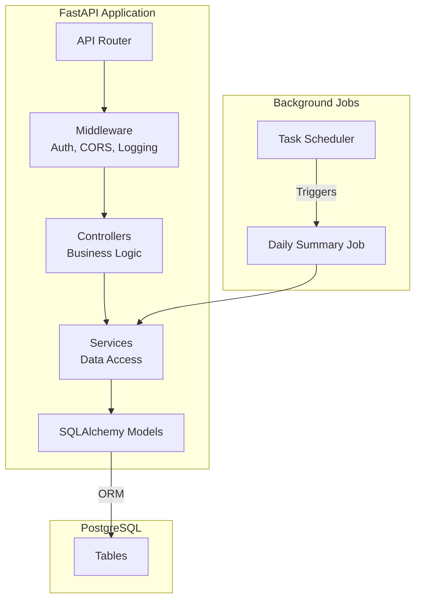
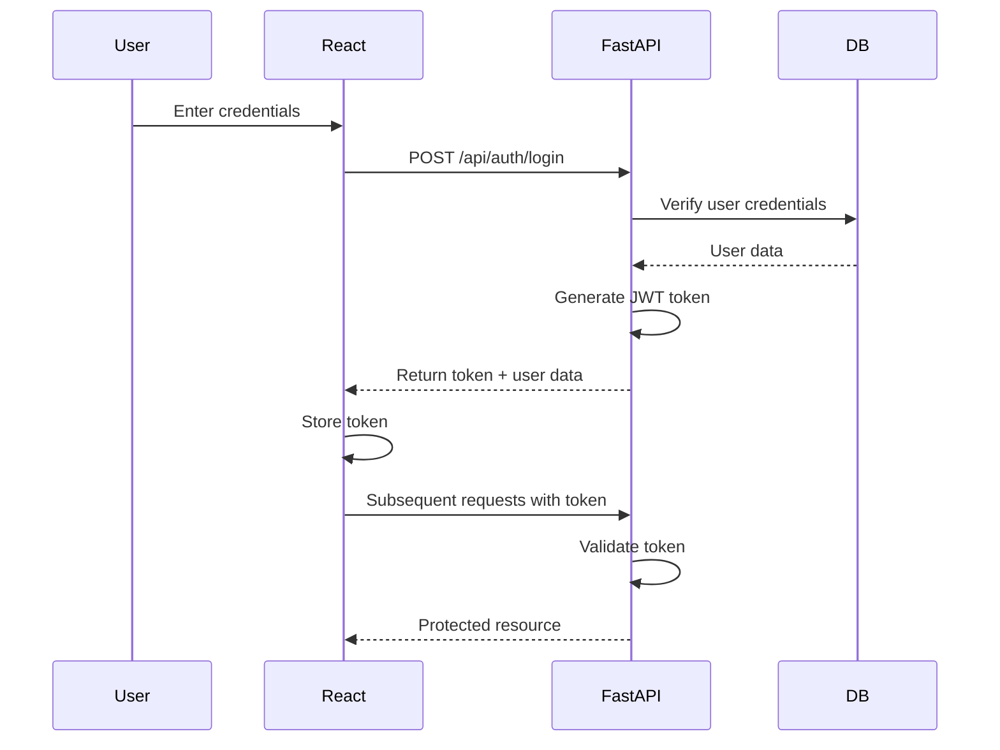
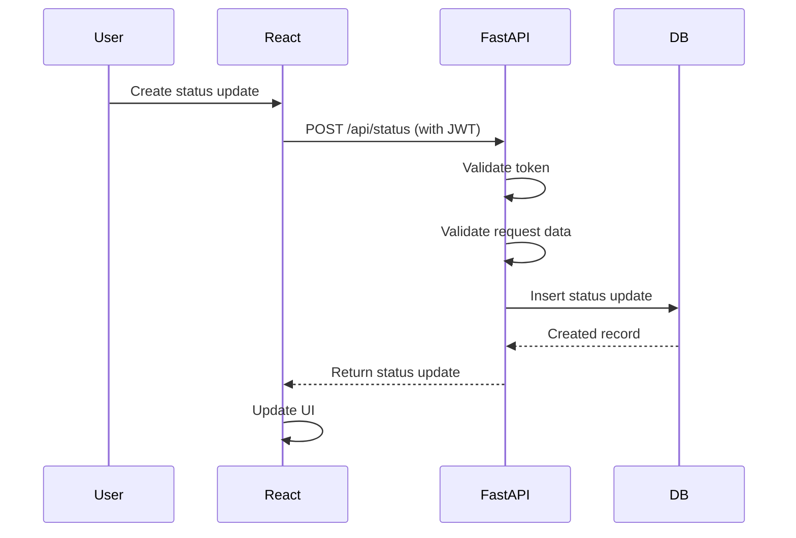
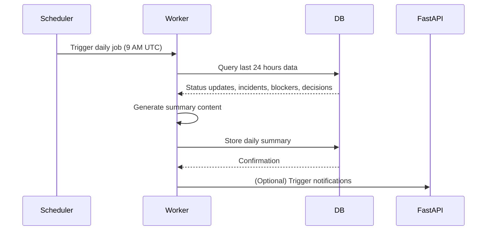
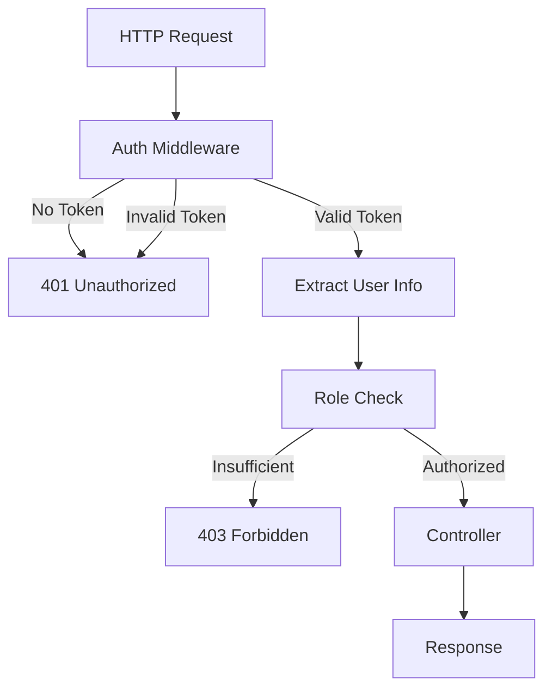
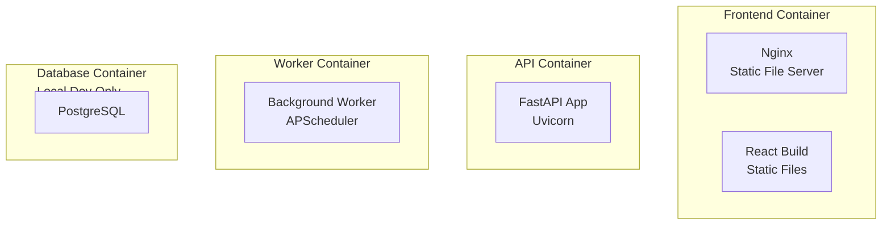
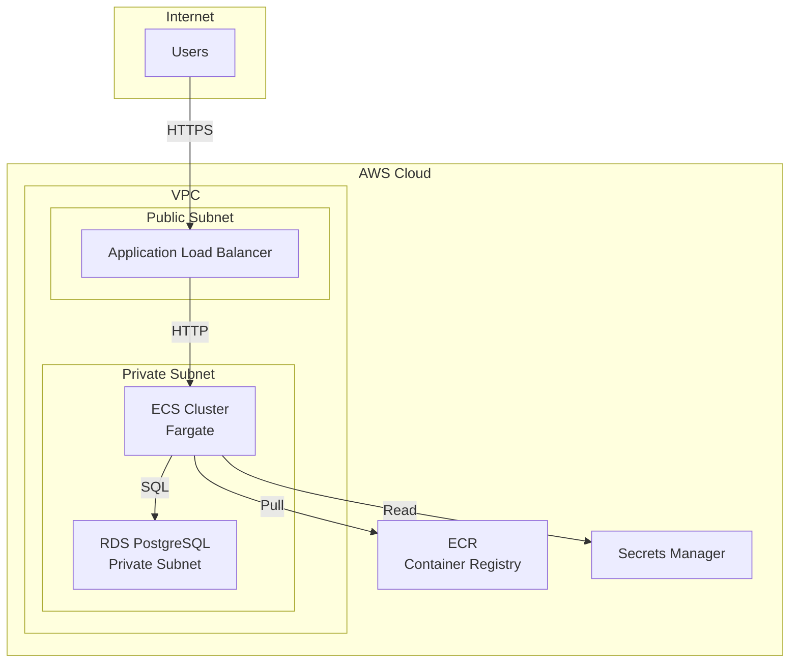
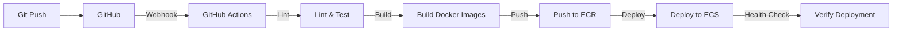

# Architecture Documentation

This document describes the system architecture, component interactions, technology choices, and design decisions for AsyncOps.

## System Architecture Overview



## Component Architecture

### Frontend Architecture



**Technology Stack**:
- **React 18+**: Component-based UI library
- **TypeScript**: Type safety and better developer experience
- **React Router**: Client-side routing
- **Context API**: State management (auth, user)
- **Fetch API / Axios**: HTTP client for API calls
- **CSS Modules / Tailwind**: Styling (choice during implementation)

**Key Components**:
- Authentication components (Login, Register)
- Dashboard layout
- Status updates list and form
- Incidents management
- Blockers tracking
- Decision log viewer
- Daily summaries display

---

### Backend Architecture



**Technology Stack**:
- **FastAPI**: Modern, fast Python web framework with async support
- **SQLAlchemy**: ORM for database interactions
- **Alembic**: Database migration tool
- **Pydantic**: Data validation and settings management
- **python-jose**: JWT token handling
- **passlib**: Password hashing (bcrypt)
- **Celery** (optional) or **FastAPI BackgroundTasks**: Background job processing

**Project Structure**:
```
backend/
  app/
    api/
      v1/
        endpoints/
          auth.py
          users.py
          status.py
          incidents.py
          blockers.py
          decisions.py
          summaries.py
    core/
      config.py
      security.py
      dependencies.py
    db/
      base.py
      session.py
      models/
        user.py
        status_update.py
        incident.py
        blocker.py
        decision.py
        daily_summary.py
    schemas/
      user.py
      status_update.py
      ...
    services/
      auth_service.py
      status_service.py
      ...
    workers/
      summary_generator.py
  migrations/
  tests/
  Dockerfile
  requirements.txt
```

---

## Data Flow

### Authentication Flow



### Status Update Creation Flow



### Daily Summary Generation Flow



---

## Technology Choices & Rationale

### Frontend: React + TypeScript

**Why React?**
- Industry standard, large ecosystem
- Component reusability
- Strong community and documentation
- Good performance with virtual DOM
- Easy to find developers familiar with it

**Why TypeScript?**
- Type safety catches errors at compile time
- Better IDE support and autocomplete
- Self-documenting code
- Easier refactoring
- Reduces runtime errors

**Alternatives Considered**:
- Vue.js: Good alternative, but React has larger ecosystem
- Angular: Too heavyweight for this project
- Svelte: Less mature ecosystem

---

### Backend: FastAPI (Python)

**Why FastAPI?**
- Excellent async support (matches async-first philosophy)
- Automatic OpenAPI/Swagger documentation
- Fast performance (comparable to Node.js)
- Type hints and Pydantic validation
- Easy to learn Python syntax
- Great for data processing (daily summaries)

**Why Python?**
- Strong data processing libraries
- Easy to write and maintain
- Good for background jobs
- Large ecosystem

**Alternatives Considered**:
- Node.js/Express: Good choice, but FastAPI's async is more intuitive
- Django: Too heavyweight, less async-friendly
- Go: Faster but more verbose, smaller ecosystem

---

### Database: PostgreSQL

**Why PostgreSQL?**
- Relational integrity for complex data
- Full-text search capabilities
- JSONB support for flexible data (daily summaries)
- ACID compliance for data reliability
- Excellent performance and scalability
- Strong ecosystem and tooling

**Alternatives Considered**:
- MongoDB: NoSQL not needed, relational data fits better
- MySQL: PostgreSQL has better features (JSONB, full-text search)
- SQLite: Not suitable for production, no concurrent writes

---

### Authentication: JWT

**Why JWT?**
- Stateless (no server-side session storage)
- Scalable (works across multiple servers)
- Self-contained (user info in token)
- Industry standard
- Easy to implement

**Alternatives Considered**:
- Session-based: Requires session storage, less scalable
- OAuth only: More complex, JWT simpler for MVP

---

### Containerization: Docker

**Why Docker?**
- Consistent environments (dev, staging, prod)
- Easy deployment
- Isolation of services
- Industry standard
- Works well with AWS ECS

---

### Cloud: AWS

**Why AWS?**
- Industry leader, reliable
- ECS for container orchestration
- RDS for managed PostgreSQL
- Good documentation and tooling
- Scalable infrastructure

**Alternatives Considered**:
- Google Cloud: Good alternative, but AWS more common
- Azure: Good for Microsoft stack, but AWS more universal
- Heroku: Simpler but more expensive, less control

---

## Security Architecture

### Authentication & Authorization



**Security Measures**:
- Passwords hashed with bcrypt (cost factor 12)
- JWT tokens signed with HS256 algorithm
- Token expiration (24 hours)
- HTTPS only in production
- CORS configured for allowed origins
- Input validation on all endpoints
- SQL injection prevention (parameterized queries via ORM)
- XSS prevention (input sanitization, React escapes by default)

---

### Data Protection

- **Encryption at Rest**: AWS RDS encryption enabled
- **Encryption in Transit**: TLS/HTTPS for all connections
- **Secrets Management**: Environment variables, AWS Secrets Manager for production
- **Password Policy**: Minimum 8 characters, alphanumeric required
- **Token Security**: HTTP-only cookies (optional) or secure storage

---

## Background Job Processing

### Daily Summary Generation

**Option 1: FastAPI BackgroundTasks** (Simpler, MVP)
- Built into FastAPI
- Runs in same process
- Good for simple, infrequent jobs
- No additional infrastructure needed

**Option 2: Celery** (More robust, production-ready)
- Separate worker processes
- Better for complex jobs
- Retry logic, task queues
- Requires Redis/RabbitMQ

**Recommendation**: Start with FastAPI BackgroundTasks for MVP, migrate to Celery if needed.

### Job Scheduling

- **APScheduler**: Python library for scheduling
- Runs in worker container
- Configurable schedule (default: daily at 9 AM UTC)
- Retry logic on failure
- Logging for monitoring

---

## Containerization Strategy

### Container Structure



**Multi-stage Docker Builds**:
- Frontend: Build React app, serve with Nginx
- Backend: Install dependencies, run FastAPI with Uvicorn
- Worker: Same as backend, but runs worker process

**Docker Compose** (Local Development):
- Frontend service
- Backend service
- Worker service
- PostgreSQL service
- Network configuration

---

## API Design Principles

### RESTful Conventions
- Use HTTP methods correctly (GET, POST, PATCH, DELETE)
- Resource-based URLs (`/api/status/{id}`)
- Proper status codes
- JSON request/response bodies
- Consistent error format

### Async-First Design
- FastAPI async endpoints
- Database connection pooling
- Non-blocking I/O operations
- Efficient handling of concurrent requests

### Error Handling
- Consistent error response format
- Appropriate HTTP status codes
- Detailed error messages (development)
- Sanitized error messages (production)
- Logging for debugging

---

## Scalability Considerations

### Horizontal Scaling
- Stateless API (JWT tokens)
- Multiple API containers behind load balancer
- Database connection pooling
- Read replicas (future) for read-heavy operations

### Performance Optimization
- Database indexes on frequently queried columns
- Pagination on all list endpoints
- Caching (future): Redis for frequently accessed data
- CDN (future): For static assets

### Monitoring & Observability
- Application logs (structured JSON)
- Error tracking (Sentry or similar)
- Performance monitoring (APM tools)
- Database query monitoring
- Container health checks

---

## Deployment Architecture

### AWS Infrastructure



**Components**:
- **VPC**: Isolated network environment
- **Public Subnet**: Internet-facing resources (ALB)
- **Private Subnet**: Internal resources (ECS, RDS)
- **Application Load Balancer**: Routes traffic to ECS tasks
- **ECS Fargate**: Serverless container hosting
- **RDS**: Managed PostgreSQL database
- **ECR**: Docker image registry
- **Secrets Manager**: Secure secrets storage

---

## Development Workflow

### Local Development
1. Docker Compose starts all services
2. Hot reload for frontend (Vite/Webpack dev server)
3. Hot reload for backend (uvicorn with reload)
4. Database migrations via Alembic
5. Test database for integration tests

### CI/CD Pipeline



**Pipeline Steps**:
1. Code pushed to repository
2. GitHub Actions triggered
3. Run linters and tests
4. Build Docker images
5. Push to ECR
6. Deploy to ECS (rolling update)
7. Health checks verify deployment

---

## Tradeoffs & Decisions

### REST over GraphQL
**Decision**: Use REST API
**Rationale**: 
- Simpler to implement and understand
- Better for MVP timeline
- Easier caching
- Standard HTTP caching works well

**Tradeoff**: Less flexible queries, but sufficient for MVP needs

---

### Async Summaries over Real-time Updates
**Decision**: Daily automated summaries instead of WebSocket real-time updates
**Rationale**:
- Aligns with async-first philosophy
- Simpler implementation
- Lower infrastructure complexity
- Sufficient for MVP

**Tradeoff**: Less immediate visibility, but fits async workflow better

---

### FastAPI BackgroundTasks over Celery
**Decision**: Start with BackgroundTasks for MVP
**Rationale**:
- Simpler, no additional infrastructure
- Sufficient for daily summary job
- Can migrate to Celery later if needed

**Tradeoff**: Less robust than Celery, but adequate for MVP

---

### Single Database over Microservices
**Decision**: Monolithic backend with single database
**Rationale**:
- Faster development
- Simpler deployment
- Easier to maintain for MVP
- Can split later if needed

**Tradeoff**: Less scalable, but sufficient for MVP and early growth

---

## Future Architecture Considerations

### Potential Enhancements
- **WebSockets**: Real-time updates (if needed)
- **Message Queue**: RabbitMQ/Kafka for event-driven architecture
- **Caching Layer**: Redis for frequently accessed data
- **CDN**: CloudFront for static assets
- **Read Replicas**: Database read replicas for scaling reads
- **Microservices**: Split into separate services if needed
- **Event Sourcing**: For comprehensive audit trails
- **Multi-tenancy**: Organization-level isolation

### Migration Path
- Start with current architecture
- Monitor performance and bottlenecks
- Add enhancements incrementally
- Refactor when needed, not prematurely

---

## Performance Targets

### Response Times
- API endpoints: < 500ms (95th percentile)
- Page load: < 2 seconds
- Database queries: < 100ms (95th percentile)

### Throughput
- Support 100 concurrent users
- Handle 1000 requests per minute
- Scale horizontally as needed

### Availability
- Target: 99.9% uptime
- Health checks and auto-recovery
- Zero-downtime deployments

---

## Monitoring & Logging

### Application Logging
- Structured JSON logs
- Log levels: DEBUG, INFO, WARNING, ERROR
- Include request ID for tracing
- Log to CloudWatch (AWS)

### Metrics
- Request rate and latency
- Error rates
- Database connection pool usage
- Container resource usage (CPU, memory)

### Alerts
- High error rates
- Slow response times
- Database connection issues
- Container health check failures

---

This architecture provides a solid foundation for the AsyncOps MVP while allowing for future enhancements as the application grows.
