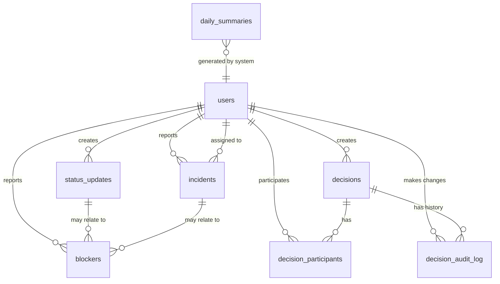

# Database Schema

This document describes the database schema for AsyncOps, including entity relationships, table definitions, indexes, and migration strategy.

## Entity Relationship Diagram



## Table Definitions

### users

Stores user account information and authentication data.

| Column | Type | Constraints | Description |
|--------|------|-------------|-------------|
| id | SERIAL | PRIMARY KEY | Unique user identifier |
| email | VARCHAR(255) | UNIQUE, NOT NULL | User email address (login) |
| password_hash | VARCHAR(255) | NOT NULL | Bcrypt hashed password |
| full_name | VARCHAR(255) | NOT NULL | User's full name |
| role | VARCHAR(20) | NOT NULL, DEFAULT 'member' | User role: 'admin' or 'member' |
| is_active | BOOLEAN | NOT NULL, DEFAULT true | Account active status |
| created_at | TIMESTAMP | NOT NULL, DEFAULT NOW() | Account creation timestamp |
| updated_at | TIMESTAMP | NOT NULL, DEFAULT NOW() | Last update timestamp |

**Indexes**:
- `idx_users_email` on `email` (unique index)
- `idx_users_role` on `role`

**Triggers**:
- `update_updated_at` trigger to automatically update `updated_at` on row changes

---

### status_updates

Stores async status updates posted by team members.

| Column | Type | Constraints | Description |
|--------|------|-------------|-------------|
| id | SERIAL | PRIMARY KEY | Unique status update identifier |
| user_id | INTEGER | NOT NULL, FK → users.id | User who created the update |
| title | VARCHAR(200) | NOT NULL | Status update title |
| content | TEXT | NOT NULL | Status update content (markdown) |
| tags | TEXT[] | | Array of tags for categorization |
| created_at | TIMESTAMP | NOT NULL, DEFAULT NOW() | Creation timestamp |
| updated_at | TIMESTAMP | NOT NULL, DEFAULT NOW() | Last update timestamp |

**Foreign Keys**:
- `user_id` REFERENCES `users(id)` ON DELETE CASCADE

**Indexes**:
- `idx_status_updates_user_id` on `user_id`
- `idx_status_updates_created_at` on `created_at DESC`
- `idx_status_updates_tags` on `tags` (GIN index for array search)

**Constraints**:
- `content` length limit: 10,000 characters (enforced in application)
- `title` length limit: 200 characters (enforced in application)

---

### incidents

Stores incident reports and their resolution status.

| Column | Type | Constraints | Description |
|--------|------|-------------|-------------|
| id | SERIAL | PRIMARY KEY | Unique incident identifier |
| reported_by_id | INTEGER | NOT NULL, FK → users.id | User who reported the incident |
| assigned_to_id | INTEGER | FK → users.id | User assigned to resolve (nullable) |
| title | VARCHAR(200) | NOT NULL | Incident title |
| description | TEXT | NOT NULL | Detailed incident description |
| severity | VARCHAR(20) | NOT NULL, DEFAULT 'medium' | Severity: 'low', 'medium', 'high', 'critical' |
| status | VARCHAR(20) | NOT NULL, DEFAULT 'open' | Status: 'open', 'in_progress', 'resolved', 'closed' |
| resolution_notes | TEXT | | Notes added when resolving |
| created_at | TIMESTAMP | NOT NULL, DEFAULT NOW() | Creation timestamp |
| updated_at | TIMESTAMP | NOT NULL, DEFAULT NOW() | Last update timestamp |
| resolved_at | TIMESTAMP | | Resolution timestamp (nullable) |

**Foreign Keys**:
- `reported_by_id` REFERENCES `users(id)` ON DELETE SET NULL
- `assigned_to_id` REFERENCES `users(id)` ON DELETE SET NULL

**Indexes**:
- `idx_incidents_reported_by` on `reported_by_id`
- `idx_incidents_assigned_to` on `assigned_to_id`
- `idx_incidents_status` on `status`
- `idx_incidents_severity` on `severity`
- `idx_incidents_created_at` on `created_at DESC`
- Composite index: `idx_incidents_status_severity` on `(status, severity)`

**Constraints**:
- `severity` CHECK IN ('low', 'medium', 'high', 'critical')
- `status` CHECK IN ('open', 'in_progress', 'resolved', 'closed')
- `description` length limit: 5,000 characters (enforced in application)
- `title` length limit: 200 characters (enforced in application)

---

### blockers

Stores blockers that are preventing progress.

| Column | Type | Constraints | Description |
|--------|------|-------------|-------------|
| id | SERIAL | PRIMARY KEY | Unique blocker identifier |
| reported_by_id | INTEGER | NOT NULL, FK → users.id | User who reported the blocker |
| description | TEXT | NOT NULL | Blocker description |
| impact | TEXT | NOT NULL | Impact of the blocker |
| status | VARCHAR(20) | NOT NULL, DEFAULT 'active' | Status: 'active', 'resolved' |
| resolution_notes | TEXT | | Notes added when resolving |
| related_status_id | INTEGER | FK → status_updates.id | Related status update (nullable) |
| related_incident_id | INTEGER | FK → incidents.id | Related incident (nullable) |
| created_at | TIMESTAMP | NOT NULL, DEFAULT NOW() | Creation timestamp |
| updated_at | TIMESTAMP | NOT NULL, DEFAULT NOW() | Last update timestamp |
| resolved_at | TIMESTAMP | | Resolution timestamp (nullable) |

**Foreign Keys**:
- `reported_by_id` REFERENCES `users(id)` ON DELETE SET NULL
- `related_status_id` REFERENCES `status_updates(id)` ON DELETE SET NULL
- `related_incident_id` REFERENCES `incidents(id)` ON DELETE SET NULL

**Indexes**:
- `idx_blockers_reported_by` on `reported_by_id`
- `idx_blockers_status` on `status`
- `idx_blockers_created_at` on `created_at DESC`
- `idx_blockers_related_status` on `related_status_id`
- `idx_blockers_related_incident` on `related_incident_id`

**Constraints**:
- `status` CHECK IN ('active', 'resolved')
- `description` length limit: 2,000 characters (enforced in application)
- `impact` length limit: 1,000 characters (enforced in application)

---

### decisions

Stores decisions made by the team with full context.

| Column | Type | Constraints | Description |
|--------|------|-------------|-------------|
| id | SERIAL | PRIMARY KEY | Unique decision identifier |
| created_by_id | INTEGER | NOT NULL, FK → users.id | User who created the decision record |
| title | VARCHAR(200) | NOT NULL | Decision title |
| description | TEXT | NOT NULL | Decision description |
| context | TEXT | NOT NULL | Context leading to the decision |
| outcome | TEXT | NOT NULL | Expected or actual outcome |
| decision_date | DATE | NOT NULL | Date the decision was made |
| tags | TEXT[] | | Array of tags for categorization |
| created_at | TIMESTAMP | NOT NULL, DEFAULT NOW() | Record creation timestamp |
| updated_at | TIMESTAMP | NOT NULL, DEFAULT NOW() | Last update timestamp |

**Foreign Keys**:
- `created_by_id` REFERENCES `users(id)` ON DELETE SET NULL

**Indexes**:
- `idx_decisions_created_by` on `created_by_id`
- `idx_decisions_decision_date` on `decision_date DESC`
- `idx_decisions_tags` on `tags` (GIN index for array search)
- Full-text search index on `title` and `description`

**Constraints**:
- `title` length limit: 200 characters (enforced in application)
- `description`, `context`, `outcome` length limit: 5,000 characters each (enforced in application)

---

### decision_participants

Junction table linking decisions to participating users.

| Column | Type | Constraints | Description |
|--------|------|-------------|-------------|
| id | SERIAL | PRIMARY KEY | Unique participant record identifier |
| decision_id | INTEGER | NOT NULL, FK → decisions.id | Decision ID |
| user_id | INTEGER | NOT NULL, FK → users.id | Participating user ID |
| created_at | TIMESTAMP | NOT NULL, DEFAULT NOW() | Record creation timestamp |

**Foreign Keys**:
- `decision_id` REFERENCES `decisions(id)` ON DELETE CASCADE
- `user_id` REFERENCES `users(id)` ON DELETE CASCADE

**Indexes**:
- `idx_decision_participants_decision` on `decision_id`
- `idx_decision_participants_user` on `user_id`
- Unique constraint: `(decision_id, user_id)` to prevent duplicates

---

### decision_audit_log

Stores audit trail of changes to decisions.

| Column | Type | Constraints | Description |
|--------|------|-------------|-------------|
| id | SERIAL | PRIMARY KEY | Unique audit log entry identifier |
| decision_id | INTEGER | NOT NULL, FK → decisions.id | Decision that was changed |
| changed_by_id | INTEGER | NOT NULL, FK → users.id | User who made the change |
| change_type | VARCHAR(20) | NOT NULL | Type: 'created', 'updated', 'deleted' |
| field_name | VARCHAR(100) | | Field that was changed (for updates) |
| old_value | TEXT | | Previous value (for updates) |
| new_value | TEXT | | New value (for updates) |
| changed_at | TIMESTAMP | NOT NULL, DEFAULT NOW() | Change timestamp |

**Foreign Keys**:
- `decision_id` REFERENCES `decisions(id)` ON DELETE CASCADE
- `changed_by_id` REFERENCES `users(id)` ON DELETE SET NULL

**Indexes**:
- `idx_decision_audit_decision` on `decision_id`
- `idx_decision_audit_changed_by` on `changed_by_id`
- `idx_decision_audit_changed_at` on `changed_at DESC`

**Constraints**:
- `change_type` CHECK IN ('created', 'updated', 'deleted')

---

### daily_summaries

Stores automatically generated daily summaries.

| Column | Type | Constraints | Description |
|--------|------|-------------|-------------|
| id | SERIAL | PRIMARY KEY | Unique summary identifier |
| summary_date | DATE | NOT NULL, UNIQUE | Date the summary covers |
| content | JSONB | NOT NULL | Summary content (structured JSON) |
| status_updates_count | INTEGER | NOT NULL, DEFAULT 0 | Count of new status updates |
| incidents_count | INTEGER | NOT NULL, DEFAULT 0 | Count of active incidents |
| blockers_count | INTEGER | NOT NULL, DEFAULT 0 | Count of active blockers |
| decisions_count | INTEGER | NOT NULL, DEFAULT 0 | Count of recent decisions |
| generated_at | TIMESTAMP | NOT NULL, DEFAULT NOW() | Generation timestamp |
| created_at | TIMESTAMP | NOT NULL, DEFAULT NOW() | Record creation timestamp |

**Indexes**:
- `idx_daily_summaries_date` on `summary_date DESC` (unique index)
- `idx_daily_summaries_generated_at` on `generated_at DESC`

**Constraints**:
- `summary_date` UNIQUE to prevent duplicate summaries for same date

**JSONB Structure** (example):
```json
{
  "status_updates": [
    {
      "id": 1,
      "title": "Weekly update",
      "author": "John Doe",
      "created_at": "2024-01-15T10:00:00Z"
    }
  ],
  "incidents": [
    {
      "id": 1,
      "title": "API outage",
      "severity": "critical",
      "status": "open"
    }
  ],
  "blockers": [
    {
      "id": 1,
      "description": "Waiting on API key",
      "status": "active"
    }
  ],
  "recent_decisions": [
    {
      "id": 1,
      "title": "Adopt new framework",
      "decision_date": "2024-01-14"
    }
  ],
  "statistics": {
    "total_status_updates": 5,
    "critical_incidents": 1,
    "active_blockers": 2,
    "decisions_last_7_days": 3
  }
}
```

---

## Relationships Summary

### One-to-Many Relationships
- `users` → `status_updates` (user creates many status updates)
- `users` → `incidents` (user reports many incidents, user can be assigned many incidents)
- `users` → `blockers` (user reports many blockers)
- `users` → `decisions` (user creates many decisions)
- `users` → `decision_audit_log` (user makes many audit log entries)
- `status_updates` → `blockers` (status update can relate to many blockers)
- `incidents` → `blockers` (incident can relate to many blockers)
- `decisions` → `decision_participants` (decision has many participants)
- `decisions` → `decision_audit_log` (decision has many audit log entries)

### Many-to-Many Relationships
- `users` ↔ `decisions` (via `decision_participants` - users participate in many decisions, decisions have many participants)

---

## Indexes Summary

### Performance-Critical Indexes
- All foreign key columns are indexed
- Date/timestamp columns used for sorting are indexed
- Status and severity columns used for filtering are indexed
- Full-text search indexes on decision title/description
- GIN indexes on array columns (tags)

### Composite Indexes
- `incidents(status, severity)` for efficient filtering and sorting

---

## Migration Strategy

### Initial Migration
1. Create `users` table
2. Create `status_updates` table
3. Create `incidents` table
4. Create `blockers` table
5. Create `decisions` table
6. Create `decision_participants` table
7. Create `decision_audit_log` table
8. Create `daily_summaries` table
9. Create all indexes
10. Create triggers (e.g., `update_updated_at`)

### Migration Tool
- Use **Alembic** (Python) for database migrations
- Migrations stored in `backend/migrations/versions/`
- Each migration is versioned and reversible

### Sample Migration File Structure
```
backend/
  migrations/
    versions/
      001_initial_schema.py
      002_add_indexes.py
      ...
    env.py
    script.py.mako
```

---

## Seed Data

### Initial Admin User
Create a default admin user for initial setup:
- Email: `admin@asyncops.local` (change in production)
- Password: Generated securely, must be changed on first login
- Role: `admin`

### Sample Data (Development)
Optional seed data for development/testing:
- 5-10 sample users (mix of admin and member roles)
- 20-30 sample status updates
- 5-10 sample incidents (various severities and statuses)
- 5-10 sample blockers (mix of active and resolved)
- 10-15 sample decisions with participants
- 7 days of sample daily summaries

---

## Data Retention & Archiving

### Retention Policy
- Status updates: Keep indefinitely (can be archived after 1 year)
- Incidents: Keep indefinitely, mark as archived after 1 year if resolved
- Blockers: Keep indefinitely, mark as archived after resolution + 6 months
- Decisions: Keep indefinitely (historical record)
- Daily summaries: Keep indefinitely (historical record)
- Audit logs: Keep indefinitely (audit requirement)

### Archiving Strategy (Future)
- Add `archived_at` timestamp column to relevant tables
- Archive old records via background job
- Archived records excluded from default queries but still accessible

---

## Security Considerations

### Data Protection
- Passwords: Never stored in plain text, always hashed with bcrypt
- Sensitive data: Consider encryption at rest for production (AWS RDS encryption)
- PII: Email addresses are PII, ensure GDPR compliance if applicable

### Access Control
- Database user with least privilege (read/write only, no DDL)
- Connection pooling to limit connections
- Prepared statements to prevent SQL injection
- Row-level security (optional, for multi-tenant future)

---

## Performance Considerations

### Query Optimization
- All foreign keys indexed
- Composite indexes for common query patterns
- Pagination on all list endpoints
- Full-text search indexes for search functionality

### Connection Management
- Use connection pooling (SQLAlchemy pool)
- Configure appropriate pool size based on expected load
- Monitor connection usage

### Monitoring
- Track slow queries (> 500ms)
- Monitor index usage
- Track table sizes and growth
- Set up alerts for connection pool exhaustion

---

## Backup & Recovery

### Backup Strategy
- Daily automated backups (AWS RDS automated backups)
- Point-in-time recovery enabled
- Backup retention: 7 days (adjustable)
- Test restore procedures regularly

### Disaster Recovery
- Cross-region backup replication (optional)
- Documented recovery procedures
- Recovery time objective (RTO): < 4 hours
- Recovery point objective (RPO): < 1 hour

---

## Future Schema Enhancements

### Potential Additions
- `organizations` table (for multi-tenant support)
- `notifications` table (for user notifications)
- `user_preferences` table (for notification settings, etc.)
- `api_tokens` table (for API access)
- `webhooks` table (for external integrations)
- Soft delete columns (`deleted_at`) for all main tables
