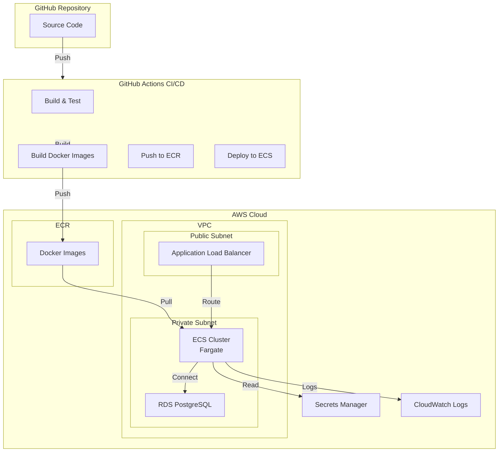

# Deployment Guide

This guide covers deploying AsyncOps to AWS using ECS (Fargate), RDS PostgreSQL, and GitHub Actions for CI/CD.

## Overview

### Deployment Architecture



---

## Prerequisites

### AWS Account Setup

1. **Create AWS Account**
   - Sign up at https://aws.amazon.com
   - Enable MFA for root account
   - Create IAM user for deployment (not root)

2. **Install AWS CLI**
   ```bash
   # macOS
   brew install awscli
   
   # Linux
   sudo apt-get install awscli
   
   # Or use pip
   pip install awscli
   ```

3. **Configure AWS CLI**
   ```bash
   aws configure
   # Enter Access Key ID
   # Enter Secret Access Key
   # Enter default region (e.g., us-east-1)
   # Enter output format (json)
   ```

4. **Install Required Tools**
   - Docker (for building images)
   - AWS CDK or Terraform (optional, for infrastructure as code)
   - kubectl (not needed for ECS, but useful for debugging)

---

## Infrastructure Setup

### Option 1: AWS Console (Manual Setup)

#### 1. Create VPC

1. Go to VPC Dashboard
2. Create VPC:
   - Name: `asyncops-vpc`
   - CIDR: `10.0.0.0/16`
   - Tenancy: Default

3. Create Public Subnet:
   - Name: `asyncops-public-subnet-1`
   - VPC: `asyncops-vpc`
   - Availability Zone: `us-east-1a`
   - CIDR: `10.0.1.0/24`
   - Enable auto-assign public IPv4

4. Create Private Subnet:
   - Name: `asyncops-private-subnet-1`
   - VPC: `asyncops-vpc`
   - Availability Zone: `us-east-1a`
   - CIDR: `10.0.2.0/24`

5. Create Internet Gateway:
   - Name: `asyncops-igw`
   - Attach to VPC

6. Create Route Table:
   - Name: `asyncops-public-rt`
   - Add route: `0.0.0.0/0` → Internet Gateway
   - Associate with public subnet

7. Create NAT Gateway (for private subnet):
   - Name: `asyncops-nat`
   - Subnet: Public subnet
   - Allocate Elastic IP
   - Create route table for private subnet: `0.0.0.0/0` → NAT Gateway

#### 2. Create RDS PostgreSQL Database

1. Go to RDS Dashboard
2. Create Database:
   - Engine: PostgreSQL 15
   - Template: Production (or Dev/Test for development)
   - DB Instance Identifier: `asyncops-db`
   - Master Username: `asyncops_admin`
   - Master Password: (generate secure password, store in Secrets Manager)
   - Instance Class: `db.t3.micro` (dev) or `db.t3.small` (prod)
   - Storage: 20 GB, General Purpose SSD
   - VPC: `asyncops-vpc`
   - Subnet Group: Create new (use private subnets)
   - Public Access: No
   - VPC Security Group: Create new `asyncops-db-sg`
   - Database Name: `asyncops`
   - Backup: Enable automated backups
   - Encryption: Enable encryption at rest

3. Security Group Rules:
   - Inbound: PostgreSQL (5432) from ECS security group only

#### 3. Create ECR Repositories

```bash
# Create repositories
aws ecr create-repository --repository-name asyncops/frontend
aws ecr create-repository --repository-name asyncops/backend
aws ecr create-repository --repository-name asyncops/worker

# Get login token
aws ecr get-login-password --region us-east-1 | docker login --username AWS --password-stdin <account-id>.dkr.ecr.us-east-1.amazonaws.com
```

#### 4. Create ECS Cluster

1. Go to ECS Dashboard
2. Create Cluster:
   - Cluster Name: `asyncops-cluster`
   - Infrastructure: AWS Fargate
   - VPC: `asyncops-vpc`

#### 5. Create Application Load Balancer

1. Go to EC2 → Load Balancers
2. Create Application Load Balancer:
   - Name: `asyncops-alb`
   - Scheme: Internet-facing
   - IP address type: IPv4
   - VPC: `asyncops-vpc`
   - Subnets: Public subnets
   - Security Group: Create new `asyncops-alb-sg`
     - Inbound: HTTP (80), HTTPS (443) from 0.0.0.0/0
   - Listener: HTTP (80) → Redirect to HTTPS (443)
   - Target Group: Create later (for ECS service)

#### 6. Store Secrets in AWS Secrets Manager

```bash
# Database credentials
aws secretsmanager create-secret \
  --name asyncops/database \
  --secret-string '{"username":"asyncops_admin","password":"<password>","host":"<rds-endpoint>","port":5432,"database":"asyncops"}'

# JWT secret
aws secretsmanager create-secret \
  --name asyncops/jwt-secret \
  --secret-string '{"secret_key":"<generate-secure-key>"}'
```

---

### Option 2: Infrastructure as Code (Recommended)

#### Using AWS CDK

Create `infrastructure/cdk/app.py`:

```python
from aws_cdk import (
    Stack,
    aws_ec2 as ec2,
    aws_ecs as ecs,
    aws_rds as rds,
    aws_ecr as ecr,
    aws_elasticloadbalancingv2 as elbv2,
    aws_secretsmanager as secretsmanager,
)
from constructs import Construct

class AsyncOpsStack(Stack):
    def __init__(self, scope: Construct, construct_id: str, **kwargs) -> None:
        super().__init__(scope, construct_id, **kwargs)
        
        # VPC
        vpc = ec2.Vpc(self, "AsyncOpsVPC", max_azs=2)
        
        # RDS
        db = rds.DatabaseInstance(
            self, "AsyncOpsDB",
            engine=rds.DatabaseInstanceEngine.postgres(version=rds.PostgresEngineVersion.VER_15),
            instance_type=ec2.InstanceType.of(ec2.InstanceClass.T3, ec2.InstanceSize.MICRO),
            vpc=vpc,
            database_name="asyncops",
            removal_policy=RemovalPolicy.DESTROY  # Change for production
        )
        
        # ECR Repositories
        frontend_repo = ecr.Repository(self, "FrontendRepo", repository_name="asyncops/frontend")
        backend_repo = ecr.Repository(self, "BackendRepo", repository_name="asyncops/backend")
        worker_repo = ecr.Repository(self, "WorkerRepo", repository_name="asyncops/worker")
        
        # ECS Cluster
        cluster = ecs.Cluster(self, "AsyncOpsCluster", vpc=vpc)
        
        # Load Balancer
        lb = elbv2.ApplicationLoadBalancer(
            self, "AsyncOpsALB",
            vpc=vpc,
            internet_facing=True
        )
```

Deploy:

```bash
cd infrastructure/cdk
cdk bootstrap
cdk deploy
```

---

## Docker Images

### 1. Backend Dockerfile

Create `backend/Dockerfile`:

```dockerfile
FROM python:3.11-slim

WORKDIR /app

# Install system dependencies
RUN apt-get update && apt-get install -y \
    gcc \
    postgresql-client \
    && rm -rf /var/lib/apt/lists/*

# Copy requirements and install Python dependencies
COPY requirements.txt .
RUN pip install --no-cache-dir -r requirements.txt

# Copy application code
COPY . .

# Run migrations and start server
CMD ["sh", "-c", "alembic upgrade head && uvicorn app.main:app --host 0.0.0.0 --port 8000"]
```

### 2. Frontend Dockerfile

Create `frontend/Dockerfile`:

```dockerfile
# Build stage
FROM node:18-alpine AS builder

WORKDIR /app

COPY package*.json ./
RUN npm ci

COPY . .
RUN npm run build

# Production stage
FROM nginx:alpine

COPY --from=builder /app/dist /usr/share/nginx/html
COPY nginx.conf /etc/nginx/conf.d/default.conf

EXPOSE 80

CMD ["nginx", "-g", "daemon off;"]
```

### 3. Worker Dockerfile

Create `backend/Dockerfile.worker`:

```dockerfile
FROM python:3.11-slim

WORKDIR /app

RUN apt-get update && apt-get install -y \
    gcc \
    postgresql-client \
    && rm -rf /var/lib/apt/lists/*

COPY requirements.txt .
RUN pip install --no-cache-dir -r requirements.txt

COPY . .

CMD ["python", "-m", "app.workers.summary_scheduler"]
```

---

## CI/CD Pipeline

### GitHub Actions Workflow

Create `.github/workflows/deploy.yml`:

```yaml
name: Deploy to AWS

on:
  push:
    branches:
      - main
  workflow_dispatch:

env:
  AWS_REGION: us-east-1
  ECR_REGISTRY: <account-id>.dkr.ecr.us-east-1.amazonaws.com
  ECS_CLUSTER: asyncops-cluster
  ECS_SERVICE_BACKEND: asyncops-backend-service
  ECS_SERVICE_FRONTEND: asyncops-frontend-service
  ECS_SERVICE_WORKER: asyncops-worker-service

jobs:
  build-and-push:
    runs-on: ubuntu-latest
    steps:
      - name: Checkout code
        uses: actions/checkout@v3

      - name: Configure AWS credentials
        uses: aws-actions/configure-aws-credentials@v2
        with:
          aws-access-key-id: ${{ secrets.AWS_ACCESS_KEY_ID }}
          aws-secret-access-key: ${{ secrets.AWS_SECRET_ACCESS_KEY }}
          aws-region: ${{ env.AWS_REGION }}

      - name: Login to Amazon ECR
        id: login-ecr
        uses: aws-actions/amazon-ecr-login@v1

      - name: Build and push backend image
        env:
          ECR_REPOSITORY: asyncops/backend
          IMAGE_TAG: ${{ github.sha }}
        run: |
          docker build -t $ECR_REGISTRY/$ECR_REPOSITORY:$IMAGE_TAG ./backend
          docker push $ECR_REGISTRY/$ECR_REPOSITORY:$IMAGE_TAG
          docker tag $ECR_REGISTRY/$ECR_REPOSITORY:$IMAGE_TAG $ECR_REGISTRY/$ECR_REPOSITORY:latest
          docker push $ECR_REGISTRY/$ECR_REPOSITORY:latest

      - name: Build and push frontend image
        env:
          ECR_REPOSITORY: asyncops/frontend
          IMAGE_TAG: ${{ github.sha }}
        run: |
          docker build -t $ECR_REGISTRY/$ECR_REPOSITORY:$IMAGE_TAG ./frontend
          docker push $ECR_REGISTRY/$ECR_REPOSITORY:$IMAGE_TAG
          docker tag $ECR_REGISTRY/$ECR_REPOSITORY:$IMAGE_TAG $ECR_REGISTRY/$ECR_REPOSITORY:latest
          docker push $ECR_REGISTRY/$ECR_REPOSITORY:latest

      - name: Build and push worker image
        env:
          ECR_REPOSITORY: asyncops/worker
          IMAGE_TAG: ${{ github.sha }}
        run: |
          docker build -f ./backend/Dockerfile.worker -t $ECR_REGISTRY/$ECR_REPOSITORY:$IMAGE_TAG ./backend
          docker push $ECR_REGISTRY/$ECR_REPOSITORY:$IMAGE_TAG
          docker tag $ECR_REGISTRY/$ECR_REPOSITORY:$IMAGE_TAG $ECR_REGISTRY/$ECR_REPOSITORY:latest
          docker push $ECR_REGISTRY/$ECR_REPOSITORY:latest

  deploy:
    needs: build-and-push
    runs-on: ubuntu-latest
    steps:
      - name: Configure AWS credentials
        uses: aws-actions/configure-aws-credentials@v2
        with:
          aws-access-key-id: ${{ secrets.AWS_ACCESS_KEY_ID }}
          aws-secret-access-key: ${{ secrets.AWS_SECRET_ACCESS_KEY }}
          aws-region: ${{ env.AWS_REGION }}

      - name: Deploy backend to ECS
        run: |
          aws ecs update-service \
            --cluster ${{ env.ECS_CLUSTER }} \
            --service ${{ env.ECS_SERVICE_BACKEND }} \
            --force-new-deployment

      - name: Deploy frontend to ECS
        run: |
          aws ecs update-service \
            --cluster ${{ env.ECS_CLUSTER }} \
            --service ${{ env.ECS_SERVICE_FRONTEND }} \
            --force-new-deployment

      - name: Deploy worker to ECS
        run: |
          aws ecs update-service \
            --cluster ${{ env.ECS_CLUSTER }} \
            --service ${{ env.ECS_SERVICE_WORKER }} \
            --force-new-deployment
```

### GitHub Secrets

Add these secrets in GitHub repository settings:

- `AWS_ACCESS_KEY_ID`: IAM user access key
- `AWS_SECRET_ACCESS_KEY`: IAM user secret key

---

## ECS Task Definitions

### Backend Task Definition

Create `infrastructure/ecs/backend-task-definition.json`:

```json
{
  "family": "asyncops-backend",
  "networkMode": "awsvpc",
  "requiresCompatibilities": ["FARGATE"],
  "cpu": "256",
  "memory": "512",
  "executionRoleArn": "arn:aws:iam::<account-id>:role/ecsTaskExecutionRole",
  "taskRoleArn": "arn:aws:iam::<account-id>:role/ecsTaskRole",
  "containerDefinitions": [
    {
      "name": "backend",
      "image": "<account-id>.dkr.ecr.us-east-1.amazonaws.com/asyncops/backend:latest",
      "portMappings": [
        {
          "containerPort": 8000,
          "protocol": "tcp"
        }
      ],
      "environment": [
        {
          "name": "ENVIRONMENT",
          "value": "production"
        }
      ],
      "secrets": [
        {
          "name": "DATABASE_URL",
          "valueFrom": "arn:aws:secretsmanager:us-east-1:<account-id>:secret:asyncops/database"
        },
        {
          "name": "SECRET_KEY",
          "valueFrom": "arn:aws:secretsmanager:us-east-1:<account-id>:secret:asyncops/jwt-secret:secret_key::"
        }
      ],
      "logConfiguration": {
        "logDriver": "awslogs",
        "options": {
          "awslogs-group": "/ecs/asyncops-backend",
          "awslogs-region": "us-east-1",
          "awslogs-stream-prefix": "ecs"
        }
      },
      "healthCheck": {
        "command": ["CMD-SHELL", "curl -f http://localhost:8000/health || exit 1"],
        "interval": 30,
        "timeout": 5,
        "retries": 3
      }
    }
  ]
}
```

Register task definition:

```bash
aws ecs register-task-definition --cli-input-json file://infrastructure/ecs/backend-task-definition.json
```

### Create ECS Services

```bash
# Backend service
aws ecs create-service \
  --cluster asyncops-cluster \
  --service-name asyncops-backend-service \
  --task-definition asyncops-backend \
  --desired-count 2 \
  --launch-type FARGATE \
  --network-configuration "awsvpcConfiguration={subnets=[subnet-xxx],securityGroups=[sg-xxx],assignPublicIp=DISABLED}" \
  --load-balancers "targetGroupArn=arn:aws:elasticloadbalancing:us-east-1:<account-id>:targetgroup/asyncops-backend-tg/xxx,containerName=backend,containerPort=8000"

# Frontend service
aws ecs create-service \
  --cluster asyncops-cluster \
  --service-name asyncops-frontend-service \
  --task-definition asyncops-frontend \
  --desired-count 2 \
  --launch-type FARGATE \
  --network-configuration "awsvpcConfiguration={subnets=[subnet-xxx],securityGroups=[sg-xxx],assignPublicIp=DISABLED}" \
  --load-balancers "targetGroupArn=arn:aws:elasticloadbalancing:us-east-1:<account-id>:targetgroup/asyncops-frontend-tg/xxx,containerName=frontend,containerPort=80"

# Worker service
aws ecs create-service \
  --cluster asyncops-cluster \
  --service-name asyncops-worker-service \
  --task-definition asyncops-worker \
  --desired-count 1 \
  --launch-type FARGATE \
  --network-configuration "awsvpcConfiguration={subnets=[subnet-xxx],securityGroups=[sg-xxx],assignPublicIp=DISABLED}"
```

---

## Database Migrations

### Run Migrations on Deploy

Add to backend Dockerfile or use init container:

```dockerfile
# In Dockerfile
CMD ["sh", "-c", "alembic upgrade head && uvicorn app.main:app --host 0.0.0.0 --port 8000"]
```

Or use ECS init container (if supported) or run migrations manually:

```bash
# SSH into ECS task or use ECS Exec
aws ecs execute-command \
  --cluster asyncops-cluster \
  --task <task-id> \
  --container backend \
  --command "alembic upgrade head" \
  --interactive
```

---

## SSL/TLS Certificate

### Request Certificate with ACM

1. Go to Certificate Manager
2. Request certificate:
   - Domain: `api.asyncops.example.com` (and `*.asyncops.example.com` for wildcard)
   - Validation: DNS validation
3. Add DNS records to validate
4. Update ALB listener to use HTTPS (443) with certificate

### Update ALB Listener

```bash
aws elbv2 create-listener \
  --load-balancer-arn <alb-arn> \
  --protocol HTTPS \
  --port 443 \
  --certificates CertificateArn=<certificate-arn> \
  --default-actions Type=forward,TargetGroupArn=<target-group-arn>
```

---

## Monitoring & Logging

### CloudWatch Logs

Logs are automatically sent to CloudWatch from ECS tasks.

View logs:

```bash
aws logs tail /ecs/asyncops-backend --follow
```

### Health Checks

- Application health endpoint: `GET /health`
- ECS health checks configured in task definition
- ALB health checks on target groups

### Alarms

Create CloudWatch alarms for:
- High error rate
- High latency
- Low task count
- Database connection issues

---

## Zero-Downtime Deployment

### Rolling Update Strategy

ECS automatically performs rolling updates:
1. Start new tasks with new image
2. Wait for health checks to pass
3. Drain connections from old tasks
4. Stop old tasks

### Deployment Process

1. Push code to `main` branch
2. GitHub Actions builds and pushes images
3. GitHub Actions triggers ECS service update
4. ECS performs rolling update
5. Health checks verify new tasks
6. Old tasks are stopped

### Rollback

If deployment fails:

```bash
# Rollback to previous task definition
aws ecs update-service \
  --cluster asyncops-cluster \
  --service asyncops-backend-service \
  --task-definition asyncops-backend:<previous-revision> \
  --force-new-deployment
```

---

## Environment Configuration

### Production Environment Variables

Store in AWS Secrets Manager or ECS task definition:

- `DATABASE_URL`: From Secrets Manager
- `SECRET_KEY`: From Secrets Manager
- `CORS_ORIGINS`: `https://asyncops.example.com`
- `ENVIRONMENT`: `production`
- `DEBUG`: `false`

### Domain Configuration

1. Create Route53 hosted zone (or use existing)
2. Create A record pointing to ALB
3. Update CORS origins in backend configuration

---

## Cost Optimization

### Estimated Monthly Costs (Development)

- RDS db.t3.micro: ~$15/month
- ECS Fargate (2 tasks): ~$30/month
- ALB: ~$20/month
- NAT Gateway: ~$35/month
- Data transfer: ~$10/month
- **Total: ~$110/month**

### Cost Optimization Tips

- Use smaller instance types for development
- Use single AZ for development (remove NAT Gateway)
- Use Spot instances for non-critical workloads
- Enable RDS automated backups with shorter retention
- Use CloudWatch log retention policies

---

## Security Best Practices

1. **Secrets Management**: Use AWS Secrets Manager, never hardcode
2. **Network Security**: Private subnets for ECS and RDS
3. **Security Groups**: Least privilege, only necessary ports
4. **Encryption**: Enable encryption at rest and in transit
5. **IAM Roles**: Use task roles, not access keys
6. **HTTPS Only**: Redirect HTTP to HTTPS
7. **Regular Updates**: Keep Docker images and dependencies updated
8. **Monitoring**: Set up alerts for security events

---

## Troubleshooting

### Deployment Issues

**Problem**: ECS tasks failing to start

**Solutions**:
- Check CloudWatch logs
- Verify task definition is correct
- Check security group rules
- Verify secrets are accessible
- Check resource limits (CPU/memory)

**Problem**: Cannot connect to database

**Solutions**:
- Verify security group allows connections from ECS
- Check database is in same VPC
- Verify database credentials in Secrets Manager
- Check RDS endpoint is correct

**Problem**: ALB health checks failing

**Solutions**:
- Verify health check endpoint exists
- Check security group allows ALB to reach ECS
- Verify target group configuration
- Check application logs for errors

---

## Post-Deployment Checklist

- [ ] Database migrations run successfully
- [ ] Health checks passing
- [ ] SSL certificate configured
- [ ] Domain DNS configured
- [ ] CORS origins updated
- [ ] Admin user created
- [ ] Monitoring and alerts configured
- [ ] Backup strategy verified
- [ ] Logs accessible in CloudWatch
- [ ] Documentation updated with production URLs

---

## Next Steps

1. Set up monitoring dashboards
2. Configure automated backups
3. Set up staging environment
4. Implement blue-green deployments (optional)
5. Add CDN for static assets (optional)
6. Set up disaster recovery plan

For more information, see:
- [Architecture Documentation](architecture.md)
- [Development Setup](development-setup.md)
- [AWS ECS Documentation](https://docs.aws.amazon.com/ecs/)
